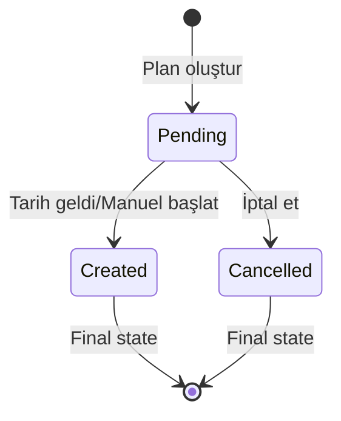
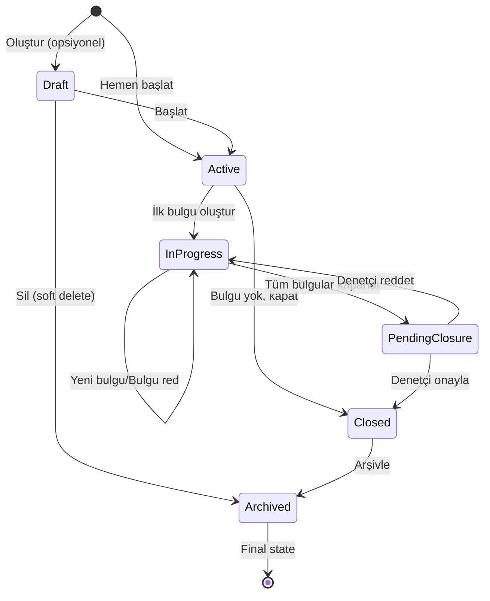
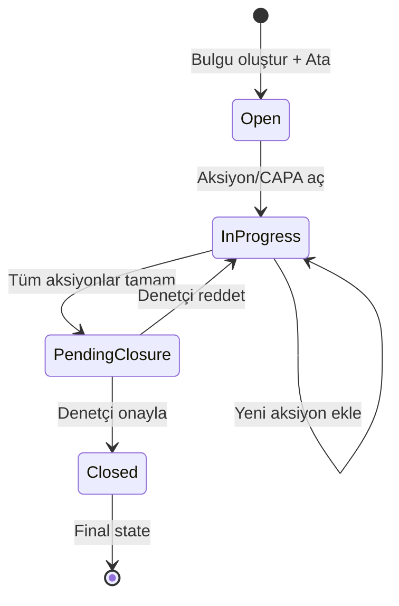
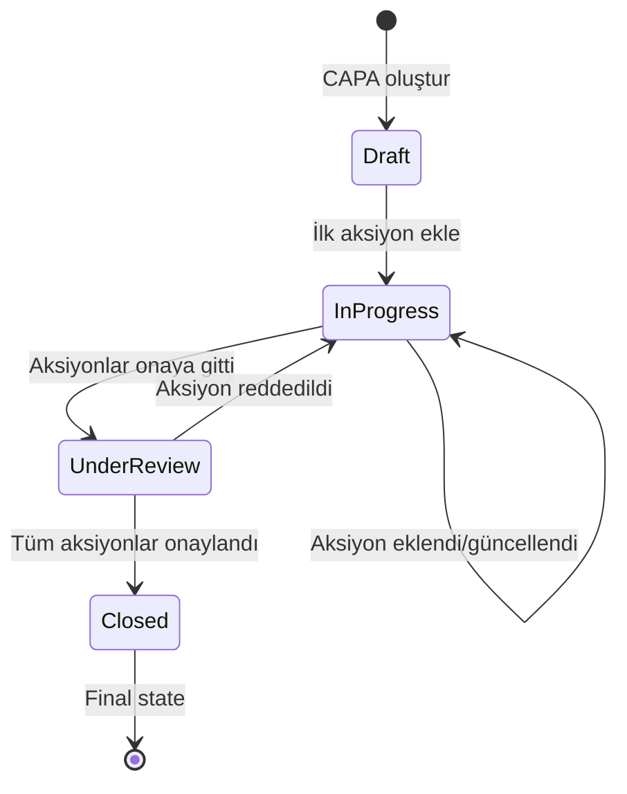
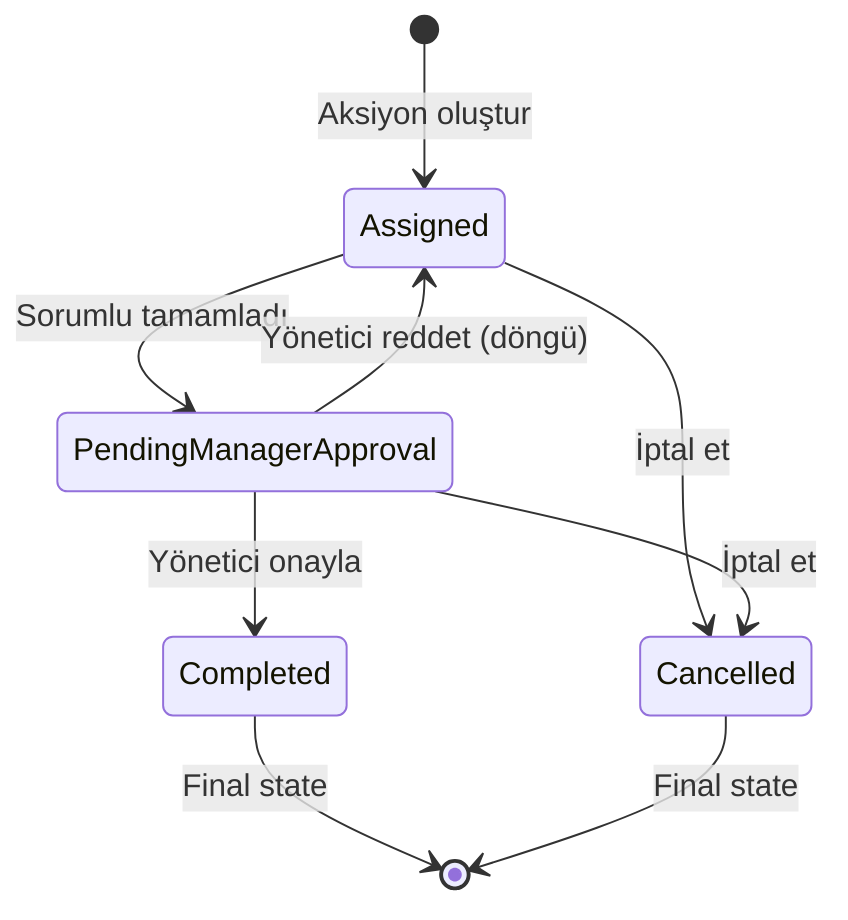

# 🔄 Denetim Sistemi - Status Workflows

## 📋 İçindekiler
- [Audit Plan Workflow](#audit-plan-workflow)
- [Audit Workflow](#audit-workflow)
- [Finding Workflow](#finding-workflow)
- [CAPA Workflow](#capa-workflow)
- [Action Workflow](#action-workflow)
- [Status Geçiş Kuralları](#status-geçiş-kuralları)
- [Otomatik Geçişler](#otomatik-geçişler)

---

## Audit Plan Workflow

### Status Enum
```typescript
"Pending"   // Bekliyor
"Created"   // Denetim oluşturuldu
"Cancelled" // İptal edildi
```

### State Machine



### Geçişler

| Mevcut Status | Aksiyon | Yeni Status | Tetikleyici | Yetki |
|--------------|---------|-------------|-------------|-------|
| `Pending` | Scheduled date geldi | `Created` | Cron job | System |
| `Pending` | Manuel başlat | `Created` | Kullanıcı | Admin/Auditor |
| `Pending` | İptal et | `Cancelled` | Kullanıcı | Admin |
| `Created` | - | - | - | - |
| `Cancelled` | - | - | - | - |

### Business Logic

```typescript
// Scheduled plan oluşturulması
async function processScheduledPlans() {
  const today = new Date();
  
  const pendingPlans = await db.query.auditPlans.findMany({
    where: and(
      eq(auditPlans.status, "Pending"),
      eq(auditPlans.scheduleType, "Scheduled"),
      lte(auditPlans.scheduledDate, today)
    )
  });
  
  for (const plan of pendingPlans) {
    // Denetim oluştur
    const audit = await createAuditFromPlan(plan);
    
    // Plan'ı güncelle
    await db.update(auditPlans)
      .set({ 
        status: "Created",
        createdAuditId: audit.id 
      })
      .where(eq(auditPlans.id, plan.id));
    
    // Periyodik ise sonraki tarihi hesapla
    if (plan.recurrenceType !== "None") {
      await scheduleNextOccurrence(plan);
    }
  }
}
```

---

## Audit Workflow

### Status Enum
```typescript
"Draft"          // Taslak (henüz başlamadı)
"Active"         // Aktif (bulgular bulunuyor)
"InProgress"     // İşlemde (bulgular çözülüyor)
"PendingClosure" // Kapanış onayı bekliyor
"Closed"         // Kapalı
"Archived"       // Arşivlendi
```

### State Machine



### Geçişler

| Mevcut Status | Aksiyon | Yeni Status | Koşul | Yetki |
|--------------|---------|-------------|-------|-------|
| `Draft` | Başlat | `Active` | - | Auditor |
| `Active` | İlk bulgu oluştur | `InProgress` | - | Auditor |
| `Active` | Bulgu yok, kapat | `Closed` | Bulgu yok | Auditor |
| `InProgress` | Tüm bulgular kapandı | `PendingClosure` | All findings = Closed | Auto |
| `InProgress` | Yeni bulgu ekle | `InProgress` | - | Auditor |
| `PendingClosure` | Denetçi onayla | `Closed` | - | Auditor |
| `PendingClosure` | Denetçi reddet | `InProgress` | - | Auditor |
| `Closed` | Arşivle | `Archived` | - | Admin |

### Business Logic

```typescript
// Finding oluşturulduğunda
async function onFindingCreated(auditId: string) {
  const audit = await getAudit(auditId);
  
  if (audit.status === "Active") {
    await db.update(audits)
      .set({ status: "InProgress" })
      .where(eq(audits.id, auditId));
  }
}

// Finding kapatıldığında
async function onFindingClosed(findingId: string) {
  const finding = await getFinding(findingId);
  const audit = await getAudit(finding.auditId);
  
  // Tüm bulgular kapandı mı kontrol et
  const openFindings = await db.query.findings.findMany({
    where: and(
      eq(findings.auditId, audit.id),
      ne(findings.status, "Closed")
    )
  });
  
  if (openFindings.length === 0 && audit.status === "InProgress") {
    // Otomatik PendingClosure'a geç
    await db.update(audits)
      .set({ status: "PendingClosure" })
      .where(eq(audits.id, audit.id));
    
    // Denetçiye bildirim gönder
    await notifyAuditor(audit.auditorId, "Denetim kapanış onayı bekliyor");
  }
}

// Denetçi kapatma işlemi
async function closeAudit(auditId: string, auditorId: string) {
  const audit = await getAudit(auditId);
  
  // Yetki kontrolü
  if (audit.auditorId !== auditorId) {
    throw new Error("Unauthorized");
  }
  
  // Status kontrolü
  if (audit.status !== "PendingClosure") {
    throw new Error("Audit is not ready for closure");
  }
  
  await db.update(audits)
    .set({ 
      status: "Closed",
      updatedAt: new Date()
    })
    .where(eq(audits.id, auditId));
  
  // Bildirimler gönder
  await notifyStakeholders(auditId, "Denetim kapatıldı");
}
```

---

## Finding Workflow

### Status Enum
```typescript
"Open"           // Açık (süreç sorumlusuna atandı)
"InProgress"     // İşlemde (aksiyon/CAPA açılıyor)
"PendingClosure" // Onay bekleniyor (aksiyonlar tamam)
"Closed"         // Kapalı (onaylandı)
```

### State Machine



### Geçişler

| Mevcut Status | Aksiyon | Yeni Status | Koşul | Yetki |
|--------------|---------|-------------|-------|-------|
| `Open` | Aksiyon/CAPA oluştur | `InProgress` | - | Process Owner |
| `InProgress` | Tüm aksiyonlar tamam | `PendingClosure` | All actions = Completed | Auto |
| `InProgress` | Yeni aksiyon ekle | `InProgress` | - | Process Owner |
| `PendingClosure` | Denetçi onayla | `Closed` | - | Auditor |
| `PendingClosure` | Denetçi reddet | `InProgress` | - | Auditor |

### Business Logic

```typescript
// Aksiyon/CAPA oluşturulduğunda
async function onActionCreated(findingId: string) {
  const finding = await getFinding(findingId);
  
  if (finding.status === "Open") {
    await db.update(findings)
      .set({ status: "InProgress" })
      .where(eq(findings.id, findingId));
  }
}

// Aksiyon tamamlandığında
async function onActionCompleted(actionId: string) {
  const action = await getAction(actionId);
  
  let findingId: string;
  
  if (action.findingId) {
    // Basit aksiyon
    findingId = action.findingId;
  } else if (action.capaId) {
    // CAPA aksiyonu
    const capa = await getCapa(action.capaId);
    findingId = capa.findingId;
  }
  
  await checkFindingCompletion(findingId);
}

// Bulgu tamamlanma kontrolü
async function checkFindingCompletion(findingId: string) {
  const finding = await getFinding(findingId);
  
  if (finding.status !== "InProgress") return;
  
  // 1. Basit aksiyonları kontrol et
  const simpleActions = await db.query.actions.findMany({
    where: and(
      eq(actions.findingId, findingId),
      eq(actions.type, "Simple")
    )
  });
  
  const simpleComplete = simpleActions.every(a => a.status === "Completed");
  
  // 2. CAPA'ları kontrol et
  const capas = await db.query.capas.findMany({
    where: eq(capas.findingId, findingId)
  });
  
  let capasComplete = true;
  
  for (const capa of capas) {
    const capaActions = await db.query.actions.findMany({
      where: eq(actions.capaId, capa.id)
    });
    
    if (!capaActions.every(a => a.status === "Completed")) {
      capasComplete = false;
      break;
    }
  }
  
  // Her şey tamamsa PendingClosure'a geç
  if (simpleComplete && capasComplete) {
    await db.update(findings)
      .set({ status: "PendingClosure" })
      .where(eq(findings.id, findingId));
    
    // Denetçiye bildirim
    const audit = await getAudit(finding.auditId);
    await notifyAuditor(audit.auditorId, `Bulgu onay bekliyor: ${finding.details}`);
  }
}

// Denetçi onaylama
async function approveFinding(findingId: string, auditorId: string) {
  const finding = await getFinding(findingId);
  const audit = await getAudit(finding.auditId);
  
  // Yetki kontrolü
  if (audit.auditorId !== auditorId) {
    throw new Error("Unauthorized");
  }
  
  // Status kontrolü
  if (finding.status !== "PendingClosure") {
    throw new Error("Finding is not ready for closure");
  }
  
  await db.update(findings)
    .set({ 
      status: "Closed",
      closedAt: new Date()
    })
    .where(eq(findings.id, findingId));
  
  // Audit status güncelle
  await onFindingClosed(findingId);
}

// Denetçi reddetme
async function rejectFinding(findingId: string, auditorId: string, reason: string) {
  const finding = await getFinding(findingId);
  const audit = await getAudit(finding.auditId);
  
  // Yetki kontrolü
  if (audit.auditorId !== auditorId) {
    throw new Error("Unauthorized");
  }
  
  if (finding.status !== "PendingClosure") {
    throw new Error("Finding is not pending closure");
  }
  
  await db.update(findings)
    .set({ 
      status: "InProgress",
      updatedAt: new Date()
    })
    .where(eq(findings.id, findingId));
  
  // Süreç sorumlusuna bildirim
  await notifyProcessOwner(
    finding.assignedToId, 
    `Bulgu reddedildi: ${reason}`
  );
}
```

---

## CAPA Workflow

### Status (Computed - Runtime)
```typescript
"Draft"       // Aksiyon yok
"Open"        // Yeni oluşturuldu
"InProgress"  // Aksiyonlar üzerinde çalışılıyor
"UnderReview" // Aksiyonlar onay bekliyor
"Closed"      // Tüm aksiyonlar tamamlandı
```

### State Machine



### Status Hesaplama

```typescript
function getCapaStatus(capaId: string): CapaStatus {
  const actions = getActionsByCapaId(capaId);
  
  // Hiç aksiyon yoksa
  if (actions.length === 0) {
    return "Draft";
  }
  
  // Tüm aksiyonlar tamamlanmış
  if (actions.every(a => a.status === "Completed")) {
    return "Closed";
  }
  
  // En az bir aksiyon onay bekliyor
  if (actions.some(a => a.status === "PendingManagerApproval")) {
    return "UnderReview";
  }
  
  // En az bir aksiyon atanmış/çalışılıyor
  if (actions.some(a => a.status === "Assigned")) {
    return "InProgress";
  }
  
  return "Open";
}
```

### UI Gösterimi

```typescript
// CAPA Card Component
function CapaCard({ capaId }: { capaId: string }) {
  const capa = useCapa(capaId);
  const actions = useCapaActions(capaId);
  const status = getCapaStatus(capaId);
  
  const completedCount = actions.filter(a => a.status === "Completed").length;
  const totalCount = actions.length;
  
  return (
    <Card>
      <CardHeader>
        <Badge variant={getStatusVariant(status)}>
          {getStatusLabel(status)}
        </Badge>
        <h3>CAPA #{capa.id.slice(0, 8)}</h3>
        <p className="text-sm text-muted-foreground">
          {completedCount}/{totalCount} aksiyonlar tamamlandı
        </p>
      </CardHeader>
      
      <CardContent>
        <div className="space-y-2">
          <div>
            <Label>Kök Neden</Label>
            <p>{capa.rootCause}</p>
          </div>
          
          <div>
            <Label>Aksiyonlar</Label>
            {actions.map(action => (
              <ActionItem key={action.id} action={action} />
            ))}
          </div>
        </div>
      </CardContent>
    </Card>
  );
}
```

---

## Action Workflow

### Status Enum
```typescript
"Assigned"              // Sorumluya atandı
"PendingManagerApproval" // Onay bekliyor
"Completed"             // Tamamlandı
"Cancelled"             // İptal edildi
```

### State Machine



### Geçişler

| Mevcut Status | Aksiyon | Yeni Status | Yetki | Notlar |
|--------------|---------|-------------|-------|--------|
| `Assigned` | Tamamla | `PendingManagerApproval` | Action Owner | Kanıt gerekli |
| `Assigned` | İptal et | `Cancelled` | Manager/Creator | Final state |
| `PendingManagerApproval` | Onayla | `Completed` | Manager | Final state |
| `PendingManagerApproval` | Reddet | `Assigned` | Manager | Döngü, sınırsız |
| `PendingManagerApproval` | İptal et | `Cancelled` | Manager/Creator | Final state |

### Business Logic

```typescript
// Aksiyon tamamlama
async function completeAction(
  actionId: string, 
  userId: string, 
  completionNotes: string,
  evidenceUrls?: string[]
) {
  const action = await getAction(actionId);
  
  // Yetki kontrolü
  if (action.assignedToId !== userId) {
    throw new Error("Unauthorized");
  }
  
  // Status kontrolü
  if (action.status !== "Assigned") {
    throw new Error("Action is not in Assigned state");
  }
  
  // Kanıt kontrolü (opsiyonel ama önerilen)
  if (!completionNotes) {
    throw new Error("Completion notes are required");
  }
  
  await db.update(actions)
    .set({ 
      status: "PendingManagerApproval",
      completionNotes,
      evidenceUrls,
      completedAt: new Date(),
      updatedAt: new Date()
    })
    .where(eq(actions.id, actionId));
  
  // Yöneticiye bildirim
  await notifyManager(
    action.managerId, 
    `Aksiyon onay bekliyor: ${action.details}`
  );
}

// Yönetici onaylama
async function approveAction(actionId: string, managerId: string) {
  const action = await getAction(actionId);
  
  // Yetki kontrolü
  if (action.managerId !== managerId) {
    throw new Error("Unauthorized");
  }
  
  // Status kontrolü
  if (action.status !== "PendingManagerApproval") {
    throw new Error("Action is not pending approval");
  }
  
  await db.update(actions)
    .set({ 
      status: "Completed",
      updatedAt: new Date()
    })
    .where(eq(actions.id, actionId));
  
  // Sorumluya bildirim
  await notifyActionOwner(
    action.assignedToId, 
    `Aksiyon onaylandı: ${action.details}`
  );
  
  // Parent güncellemeleri (Finding/CAPA)
  if (action.findingId) {
    await onActionCompleted(actionId);
  } else if (action.capaId) {
    await onActionCompleted(actionId);
  }
}

// Yönetici reddetme
async function rejectAction(
  actionId: string, 
  managerId: string, 
  rejectionReason: string
) {
  const action = await getAction(actionId);
  
  // Yetki kontrolü
  if (action.managerId !== managerId) {
    throw new Error("Unauthorized");
  }
  
  if (action.status !== "PendingManagerApproval") {
    throw new Error("Action is not pending approval");
  }
  
  // Red nedeni zorunlu
  if (!rejectionReason) {
    throw new Error("Rejection reason is required");
  }
  
  await db.update(actions)
    .set({ 
      status: "Assigned", // DÖNGÜ: Tekrar çalışılabilir
      rejectionReason,
      completionNotes: null, // Temizle
      completedAt: null,     // Sıfırla
      updatedAt: new Date()
    })
    .where(eq(actions.id, actionId));
  
  // Sorumluya bildirim
  await notifyActionOwner(
    action.assignedToId, 
    `Aksiyon reddedildi: ${rejectionReason}`
  );
  
  // Timeline'a ekle
  await addActionTimeline(actionId, "rejected", {
    reason: rejectionReason,
    rejectedBy: managerId
  });
}

// Aksiyon iptal etme
async function cancelAction(
  actionId: string, 
  userId: string, 
  reason: string
) {
  const action = await getAction(actionId);
  
  // Yetki: Yönetici VEYA Oluşturan
  if (action.managerId !== userId && action.createdById !== userId) {
    throw new Error("Unauthorized");
  }
  
  // Completed olanlar iptal edilemez
  if (action.status === "Completed") {
    throw new Error("Cannot cancel completed action");
  }
  
  await db.update(actions)
    .set({ 
      status: "Cancelled",
      rejectionReason: reason, // İptal nedeni
      updatedAt: new Date()
    })
    .where(eq(actions.id, actionId));
  
  // İlgililere bildirim
  await notifyStakeholders(actionId, `Aksiyon iptal edildi: ${reason}`);
}
```

---

## Status Geçiş Kuralları

### Validasyon Matrisi

| Entity | Geçiş | Koşul | Fail Mesajı |
|--------|-------|-------|-------------|
| Audit | Active → Closed | `findings.length === 0` | "Bulgular var, kapatılamaz" |
| Audit | InProgress → PendingClosure | All findings = Closed | Auto transition |
| Audit | PendingClosure → Closed | Auditor approval | "Onay gerekli" |
| Finding | InProgress → PendingClosure | All actions = Completed | Auto transition |
| Finding | PendingClosure → Closed | Auditor approval | "Denetçi onayı gerekli" |
| Action | Assigned → PendingApproval | `completionNotes !== null` | "Tamamlama notu gerekli" |
| Action | PendingApproval → Completed | Manager approval | "Yönetici onayı gerekli" |

---

## Otomatik Geçişler

### Cron Jobs

```typescript
// Her gün 00:00'da çalışır
export async function dailyScheduledPlanCheck() {
  await processScheduledPlans();
}

// Her gün 09:00'da çalışır
export async function dailyReminderCheck() {
  await sendDueDateReminders();
}

// Her saat çalışır
export async function hourlyOverdueCheck() {
  await checkOverdueActions();
}
```

### Event Triggers

```typescript
// Finding oluşturulduğunda
on("finding.created", async (findingId) => {
  await onFindingCreated(findingId);
});

// Action tamamlandığında
on("action.completed", async (actionId) => {
  await onActionCompleted(actionId);
});

// Finding kapandığında
on("finding.closed", async (findingId) => {
  await onFindingClosed(findingId);
});
```

---

**Versiyon:** 1.0  
**Son Güncelleme:** 23 Ekim 2025  
**Durum:** Planlama Aşaması
